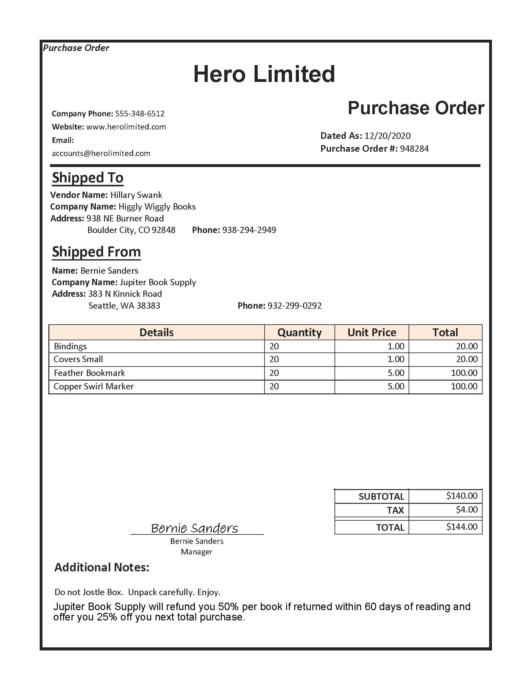
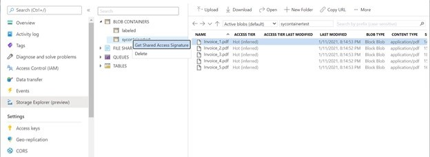

# Train and test a custom model with Form Recognizer 

**Form Recognizer** is a cognitive service that can extract key, value pairs of information from documents using optical character recognition (OCR). Form Recognizer has pre-built models for recognizing invoices, receipts, and business cards. The service also gives you the capability to create custom models, trained for your industry-specific forms. We will build custom models in this exercise.

## Clone the repository for this course

If you have not already done so, you must clone the code repository for this course:

1. Start Visual Studio Code.
2. Open the palette (SHIFT+CTRL+P) and run a `Git: Clone` command to clone the `https://github/com/MicrosoftLearning/AI-102-AIEngineer` repository to a local folder.
3. When the repository has been cloned, open the folder in Visual Studio Code.

3. Wait for the resources to be created, and then view the deployment details by navigating to the resource group where you created them.

## Custom Form Case: Hero Limited

Suppose you are an AI Engineer asked to automate the collection of invoice data for the company Hero Limited. Currently an employee at Hero Limited is still manually reading the data on each invoice and typing it into a database. You will use the Form Recognizer service to train and test custom form recognition models, first using training forms **without** labels, then using training forms **with** labels. 

We can train a custom Form Recognizer model with labeled data or data without labels. We will first train a model using forms without labels and test it. Then we will train a model using forms with labels and test that model.  

Overview of steps: 
- Gather and upload training documents to an Azure Blob Container
- Create a Form Recognizer resource, taking note of its keys and endpoint
- Configure our environment
- Run a program to train a model with or without labels
- Run a program to test the model trained with or without labels 

## Gather training data 



Take a look at the files in **20-custom-form/sample-forms/train**. We will be using these sample forms to train two models, one with labels, and one without labels. The **sample-forms** file contains all the forms we will need to train both models.  

Notice there are four types of files: 
- **.json**
- **.jpg**
- **.jpg.labels.json**
- **jpg.ocr.json**

When we train a model without labels we will only uses the **.jpg** files. When we a train a model with labels we will use both the **.jpg** and the **.json** files.

To provide your own training data to the Train Custom Model operation, you need to provide a minimum of **five** filled-in forms or an empty form (you must include the word "empty" in the file name) and two filled-in forms.

The full custom model input requirements can be found [https://docs.microsoft.com/azure/cognitive-services/form-recognizer/build-training-data-set#custom-model-input-requirements](here).    

We'll use the sample forms in the **sample-forms** folder and upload the set of form documents to an Azure blob storage container. To do this we'll create a container and upload a block blob.  

<a id="blob"></a>
## Store training data in an Azure blob storage container 

1. Open the Azure portal at [https://portal.azure.com](https://portal.azure.com), and sign in using the Microsoft account associated with your Azure subscription.
2. View the **Resource groups** in your subscription.
3. If you are using a restricted subscription in which a resource group has been provided for you, select the resource group to view its properties. Otherwise, create a new resource group with a name of your choice, and go to it when it has been created.
4. On the **Overview** page for your resource group, note the **Subscription ID** and **Location**. You will need these values, along with the name of the resource group in subsequent steps.
5. In Visual Studio Code, in the **AI-102** project, expand the **20-custom-form** folder and select **setup.cmd**. You will use this batch script to run the Azure command line interface (CLI) commands required to create the Azure resources you need.
6. Right-click the the **20-custom-form** folder and select **Open in Integrated Terminal**.
7. In the terminal pane, enter the following command to establish an authenticated connection to your Azure subscription.

    ```bash
    az login --output none
    ```

8. When prompted, open `https://microsoft.com/devicelogin`, enter the provided code, and sign into your Azure subscription. Then return to Visual Studio Code and wait for the sign-in process to complete.
9. Run the following command to list Azure locations.

    ```bash
    az account list-locations -o table
    ```

10. In the output, find the **Name** value that corresponds with the location of your resource group (for example, for *East US* the corresponding name is *eastus*).
11. In the **setup.cmd** script, modify the **subscription_id**, **resource_group**, and **location** variable declarations with the appropriate values for your subscription ID, resource group name, and location name. Then save your changes.
12. In the terminal for the **20-custom-form** folder, enter the following command to run the script:

    ```bash
    setup
    ```
13. When the script completes, review the output it displays and note the following information about your Azure resource:
    - Storage account name

14. In the Azure portal, refresh the resource group and verify that it contains the Azure Storage account and a blob file with the forms from the local **20-custom-form/sample-forms/train** folder. 

## Train a model **without labels** using the API

Now we will use Form Recognizer via the SDK.  

> **Note**: In this exercise, you can choose to use the API from either the **C#** or **Python** SDK. In the steps below, perform the actions appropriate for your preferred language.

1. In Visual Studio Code open the **AI-102** project, and in the **Explorer** pane, browse to the **20-custom-form** folder and expand the **C-Sharp** or **Python** folder depending on your language preference.
 
2. Right-click the **train-without-labels** folder and open an integrated terminal.
<a id="package"></a>
Install the Form Recognizer package by running the appropriate command for your language preference:

   **C#**

    ```
    dotnet add package Azure.AI.FormRecognizer --version 3.0.0 
    ```

   **Python**

   ```
   pip install azure-ai-formrecognizer
   ```

3. View the contents of the **train-without-labels** folder, and note that it contains a file for configuration settings:
    - **C#**: appsettings.json
    - **Python**: .env

    Open the configuration file. We will need a key, endpoint, and the URI for our stored sample forms.  
    
    <a id="getform"></a>
    ### Create a Form Recognizer resource and get your Key and Endpoint

    You will need to create a **Form Recognizer** Azure resource.  
    
    1. Navigate to the Microsoft account associated with your Azure subscription at [https://portal.azure.com](https://portal.azure.com).
    2. Select the **&#65291;Create a resource** button, search for *Form Recognizer*, and create a **Form Recognizer** resource with the following settings:
        - **Subscription**: *Your Azure subscription*
        - **Resource group**: *Choose or create a resource group (if you are using a restricted subscription, you may not have permission to create a new resource group - use the one provided)*
        - **Region**: *Choose any available region*
        - **Name**: *Enter a unique name*
        - **Pricing tier**: F0

    > **Note**: If you already have an F0 custom vision service in your subscription, select **S0** for this one.

    3. Select **Keys and Endpoint** on the left hand panel. Copy the key and endpoint into the configuration file. 
    
    Now we will obtain our storage blob's URI.  
    
    <a id ="sig"></a>
    ### Get Container's Shared Access Signature

    From the main menu of your Storage Account, navigate to **Storage Explorer**, select **BLOB CONTAINERS**, and right click on the container with your form training data. 

    
 
     Select **Get Shared Access Signature**. Then use the following configurations: 
   
    - Access Policy: (none)
    - Start time: *leave as is for this exercise* 
    - End time: *leave as is for this exercise* 
    - Time Zone: Local 
    - Permissions: _Select **Read** and **List**_ 

    Select **Create** and copy the **URI**. Paste it to your local configuration file's **STORAGE_URL** value.

     Update the configuration values it contains to reflect the endpoint and key for your Form Recognizer resource, and container Shared Access Signature. 
  
4. Note that the **train-without-labels** folder contains a code file for the client application:

    - **C#**: Program.cs
    - **Python**: train-model-without-labels&period;py

    Open the code file and review the code it contains, noting the following details:
    - Namespaces from the package you installed are imported
    - The **Main** function retrieves the configuration settings, and uses the key and endpoint to create an authenticated **Client**.

5. Return the integrated terminal for the **train-without-labels** folder, and enter the following command to run the program:

    **C#**

    ```
    dotnet run
    ```

    **Python**

    ```
    python train-model-without-labels.py
    ```

6. Wait for the program to end. 
7. Review the model. 
8. Copy the Model ID in the terminal output. You will use your Model ID when analyzing new forms.  

Now you're ready use your trained model. Notice how we trained our model using files from a storage container URI. We could also have trained our model using local files. Similarly, we can test our model using forms from a URI or from local files. We will test our form model with a local file using the **StartRecognizeCustomForms** method. However, you can also analyze new forms from a URI using the **StartRecognizeCustomFormsFromUri** method. 

## Test the model 
Now that you've got the model ID, you can use it from a client application. Once again, you can choose to use **C#** or **Python**.

1. In Visual Studio Code, in the **AI-102** project, browse to the **20-custom-form** folder and in the folder for your preferred language (**C-Sharp** or **Python**), expand the **test-without-labels** folder.
2. Right-click the **test-without-labels** folder. Open the code file for your client application (*Program.cs* for C#, *test-model-without-labels&period;py* for Python) and review the code it contains, noting the following details:
    - Namespaces from the package you installed are imported
    - The **Main** function retrieves the configuration settings, and uses the key and endpoint to create an authenticated **Client**.
    
5. Return the integrated terminal for the **test-without-labels** folder, and enter the following SDK-specific command to run the program:

    **C#**

    ```
    dotnet run
    ```

    **Python**

    ```
    python test-model-without-labels.py
    ```

6. View the output. 

Now we will train a model using labels. 


## Train a model with labels using the API

Now suppose we have labels for the same forms we used to train a model above, and want to train a new custom model with labeled data. We will be using labeled forms this time. If you have not done so, please return to the top of the page and follow instructions to upload all the sample form files to a Storage Blob. 

> **Note**: In this exercise, you can choose to use the API from either the **C#** or **Python** SDK. In the steps below, perform the actions appropriate for your preferred language.

1. In Visual Studio Code open the **AI-102** project, and in the **Explorer** pane, browse to the **20-custom-form** folder and expand the **C-Sharp** or **Python** folder depending on your language preference.
 
2. Right-click the **train-with-labels** folder and open an integrated terminal. If you have not already done so, [see here for directions](#package) to install the Form Recognizer package by running the appropriate command for your language. 

3. If you have not created an Azure blob yet for the Form Recognizer lab, please [see here for directions](#blob). Otherwise your blob should already contain images of our sample forms and labeled **.json** files. When we trained a model without labels we only used the **.jpg** forms. Now we will train a model using the **.jpg** and **.json** files from this Azure blob.  

4. View the contents of the **train-with-labels** folder, and note that it contains a file for configuration settings:
    - **C#**: appsettings.json
    - **Python**: .env

    Open the configuration file. Use the same key and endpoint from the form recognizer you created earlier. You will also want to use the same storage URI (Shared Access Signature) as you did to configure settings to train a model without labels. You can refer to the previous sections if you have not created either your container's Shared Access Signature or a Form Recognizer resource.   

    - [Get Container's Shared Access Signature](#sig)
    - [Create a Form Recognizer resource](#getform)

     Update the configuration values it contains to reflect the endpoint and key for your Form Recognizer resource, and container Shared Access Signature. 
  
5. Note that the **train-with-labels** folder contains a code file for the client application:

    - **C#**: Program.cs
    - **Python**: train-model-with-labels&period;py

    Open the code file and review the code it contains, noting the following details:
    - Namespaces from the package you installed are imported
    - The **Main** function retrieves the configuration settings, and uses the key and endpoint to create an authenticated **Client**.
    
6. Return the integrated terminal for the **train-with-labels** folder, and enter the following command to run the program:

    **C#**

    ```
    dotnet run
    ```

    **Python**

    ```
    python train-model-with-labels.py
    ```

7. Wait for the program to end. 
8. Review the model output. 
9. Copy the Model ID in the terminal output. You will use your Model ID when analyzing new forms.  

## Test the model

Now that you've got the model ID, test out the model. Once again, you can choose to use **C#** or **Python**.

1. In Visual Studio Code, in the **AI-102** project, browse to the **20-custom-form** folder and in the folder for your preferred language (**C-Sharp** or **Python**), expand the **test-with-labels** folder.
2. Right-click the **test-with-labels** folder. Open the code file for your client application (*Program.cs* for C#, *test-model-with-labels&period;py* for Python) and review the code it contains, noting the following details:
    - Namespaces from the package you installed are imported
    - The **Main** function retrieves the configuration settings, and uses the key and endpoint to create an authenticated **Client**.
    
5. Return the integrated terminal for the **test-with-labels** folder, and enter the following SDK-specific command to run the program:

    **C#**

    ```
    dotnet run
    ```

    **Python**

    ```
    python test-model-with-labels.py
    ```

6. View the output and notice the prediction confidence scores.   

## More information

For more information about the Form Recognizer service, see the [Form Recognizer documentation](https://docs.microsoft.com/azure/cognitive-services/form-recognizer/).
