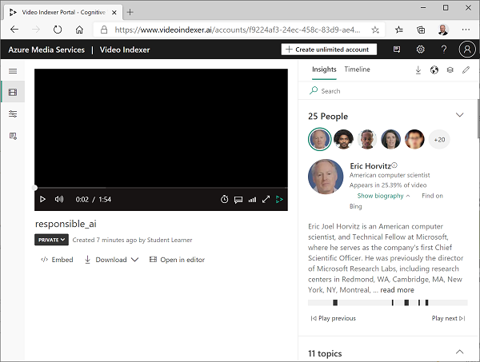
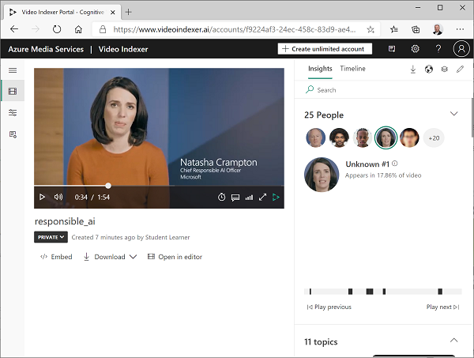
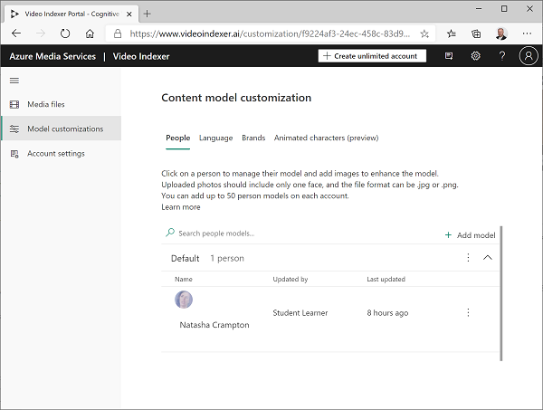

# Analyze Video with Video Indexer

A large proportion of the data created and consumed today is in the format of video. **Video Indexer** is an AI-powered service that you can use to index videos and extract insights from them.

## Clone the repository for this course

If you have not already done so, you must clone the code repository for this course:

1. Start Visual Studio Code.
2. Open the palette (SHIFT+CTRL+P) and run a `Git: Clone` command to clone the `https://github.com/GraemeMalcolm/AI-102` repository to a local folder.
3. When the repository has been cloned, open the folder in Visual Studio Code.
4. Wait while additional files are installed to support the C# code projects in the repo.

## Sign into the Video Indexer portal

The Video Indexer portal provides a web-based interface for managing video indexer projects.

1. Open the Video Indexer portal at [https://www.videoindexer.ai/](https://www.videoindexer.ai/).
2. If you have an existing Video Indexer account, sign in. Otherwise, sign up for a free account and sign in using your Microsoft account (or any other valid account type).

## Upload and index a video

You can use the Video Indexer portal to upload and index a video.

1. In Visual Studio Code, expand the **21-video-indexer** folder, and then right-click **responsible_ai.mp4** and select **Reveal in File Explorer**.
2. In Video Indexer, select the **Upload** option. Then drag the **responsible_ai.mp4** from File Manager to the upload area, review the default names and settings, select the checkbox to verify compliance with Microsoft's policies for facial recognition, and upload it.
3. After the file has uploaded, wait a few minutes while Video Indexer automatically indexes it.

## Review video insights

The indexing process extracts insights from the video, which you can view in the portal.

1. When the video is indexed, select it to view it in the portal. You'll see the video player alongside a pane that shows insights extracted from the video.

2. As the video plays, select the **Timeline** tab to view a transcript of the video audio.

3. At the top left of the portal, select the **View** symbol (which looks similar to &#128455;), and in the list of insights, in addition to **Transcript**, select **OCR** and **Speakers**.

4. Observe that the **Timeline** pane now includes:
    - Transcript of audio narration.
    - Text visible in the video.
    - Indications of speakers who appear in the video. Some well-known people are  automatically recognized by name, others are indicated by number (for example *Speaker #1*).
5. Switch back to the **Insights** pane and view the insights show there. They include:
    - Individual people who appear in the video.
    - Topics discussed in the video.
    - Labels for objects that appear in the video.
    - Named entities, such as people and brands that appear in the video.
    - Key scenes.
6. With the **Insights** pane visible, select the **View** symbol again, and in the list of insights, add **Keywords** and **Sentiments** to the pane.

    The insights found can help you determine the main themes in the video. For example, the **topics** for this video show that it is clearly about technology, social responsibility, and ethics.

## Search for insights

You can use Video indexer to search the video for insights.

1. In the **Insights** pane, in the **Search** box, enter *Bee*. You may need to scroll down in the Insights pane to see results for all types of insight.
2. Observe that one matching *label* is found, with its location in the video indicated beneath.
3. Select the beginning of the section where the presence of a bee is indicated, and view the video at that point (you may need to pause the video and select carefully - the bee only appears briefly!)

## Edit insights

You can use Video Indexer to edit the insights that have been found, adding custom information to make even more sense of the video.

1. Rewind the video to the start and view the **people** listed at the top of the **Insights** pane. Observe that some people have been recognized, including **Eric Horwitz**, a computer scientist and Technical Fellow at Microsoft.

2. Select the photo of Eric Horwitz, and view the information underneath - expanding the **Show biography** section to see information about this person.
3. Observe that the locations in the video where this person appears are indicated. You can use these to view those sections of the video.
4. In the video player, find the person speaking at approximately 0:34:

5. Observe that this person is not recognized, and has been assigned a generic name such as **Unknown #1**. However, the video does include a caption with this person's name, so we can enrich the insights by editing the details for this person.
6. At the top right of the portal, select the **Edit** icon (&#x1F589;). Then change the name of the unknown person to **Natasha Crampton**.

7. After you have made the name change, search the **Insights** pane for *Natasha*. The results should include one person, and indicate the sections of the video in which they appear.
8. At the top left of the portal, expand the menu (&#8801;) and select the **Model customizations** page. Then on the **People** tab, observe that the **Default** people model has one person in it. Video Indexer has added the person you named to a people model, so that they will be recognized in any future videos you index in your account.

You can add images of people to the default people model, or add new models of your own. This enables you to define collections of people with images of their face so that Video Indexer can recognize them in your videos.

Observe also that you can also create custom models for language (for example to specify industry-specific terminology you want Video Indexer to recognize) and brands (for example, company or product names).

## Use Video Indexer widgets

The Video Indexer portal is a useful interface to manage video indexing projects. However, there may be occasions when you want to make the video and its insights available to people who don't have access to your Video Indexer account. Video Indexer provides widgets that you can embed in a web page for this purpose.

1. In Visual Studio Code, in the **21-video-indexer** folder, open **analyze-video.html**. This is a basic HTML page to which you will add the Video Indexer **Player** and **Insights** widgets. Note the reference to the **vb.widgets.mediator.js** script in the header - this script enables multiple Video Indexer widgets on the page to interact with one another.
2. In the Video Indexer portal, return to the **Media files** page and open your **responsible_ai** video.
3. Under the video player, select **\</> Embed** to view the HTML iframe code to embed the widgets.
4. In the **Share and Embed** dialog box, select the **Player** widget and then copy the embed code to the clipboard.
5. In Visual Studio Code, in the **analyze-video.html** file, paste the copied code under the comment **\<-- Player widget goes here -- >**.
6. Edit the Player widget code to change the **width** and **height** properties to **400** and **300* respectively.
6. Back in the **Share and Embed** dialog box, select the **Insights** widget and then copy the embed code to the clipboard. Then close the **Share and Embed** dialog box, switch back to Visual Studio Code, and paste the copied code under the comment **\<-- Insights widget goes here -- >**.
7. Edit the Insights widget code to change the **width** and **height** properties to **350** and **600** respectively.
8. Save the file. Then in the **Explorer** pane, right-click **analyze-video.html** and select **Reveal in File Explorer**.
9. In File Explorer, open **analyze-video.html** in your browser to see the web page.
10. Experiment with the widgets, using the **Insights** widget to search for insights and jump to them in the video.

## More information

For more information about **Video Indexer****, see the [Video Indexer documentation](https://docs.microsoft.com/azure/media-services/video-indexer/).
