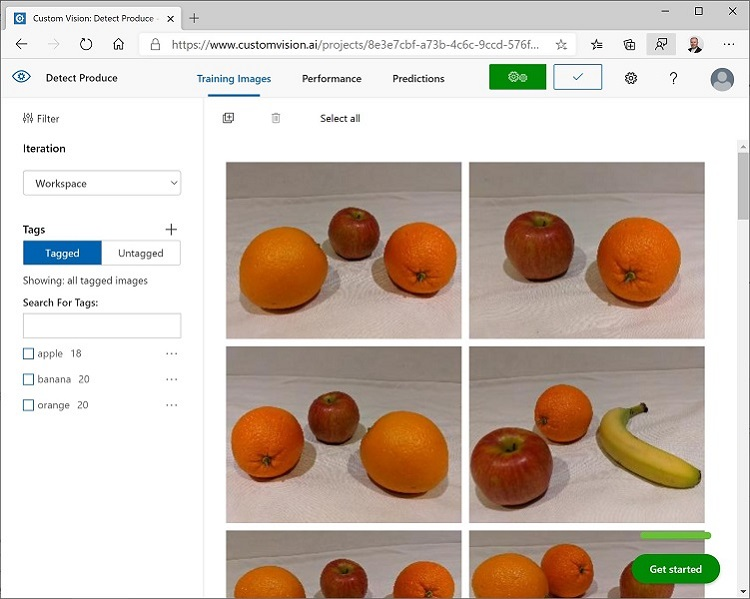

# Object Detection

In this exercise, you will use the Custom Vision service to train an *object detection* model that can detect and locate three classes of fruit (apple, banana, and orange) in an image.

## Clone the repository for this course

If you have not already done so, you must clone the code respository for this course:

1. Start Visual Studio Code.
2. Open the palette (SHIFT+CTRL+P) and run a `Git: Clone` command to clone the `https://github/com/GraemeMalcolm/AI-102` respository to a local folder.
3. When the repository has been cloned, open the folder in Visual Studio Code.

## Create Custom Vision resources

You should have created **Custom Vision** resources for training and prediction in a previous exercise, but of not (or if you have dleted them), use the following instructions to create them.

1. In a new browser tab, open the Azure portal at [https://portal.azure.com](https://portal.azure.com), and sign in using the Microsoft account associated with your Azure subscription.
2. Select the **&#65291;Create a resource** button, search for *custom vision*, and create a **Custom Vision** resource with the following settings:
    - **Create options**: Both
    - **Subscription**: *Your Azure subscription*
    - **Resource group**: *Choose or create a resource group (if you are using a hosted lab environment, you may not have permission to create a new resource group - use the one provided)*
    - **Name**: *Enter a unique name*
    - **Training location**: *Choose any available region*
    - **Training pricing tier**: F0
    - **Prediction location**: *The same region as the training resource*
    - **Prediction pricing tier**: F0

    > **Note**: If you already have an F0 custom vision service in your subscription, select **S0** for this one.

3. Wait for the resources to be created, and then view the deployment details and note that two Custom Vision resources are provisioned; one for training, and another for prediction. You can view these by navigating to the resource group where you created them.

> **Important**: Each resource has its own *endpoint* and *keys*, which are used to manage access from your code. To train an image classification model, your code must use the *training* resource (with its endpoint and key); and to use the trained model to predict image classes, your code must use the *prediction* resource (with its endpoint and key).

## Create a Custom Vision project

To train an object detection model, you need to create a Custom Vision project based on your training resource. To do this, you'll use the Custom Vision portal.

1. In a new browser tab, open the Custom Vision portal at [https://customvision.ai](https://customvision.ai), and sign in using the Microsoft account associated with your Azure subscription.
2. Create a new project with the following settings:
    - **Name**: Detect Fruit
    - **Description**: Object detection for fruit.
    - **Resource**: *The Custom Vision resource you created previously*
    - **Project Types**: Object Detection
    - **Domains**: General
3. Wait for the project to be created and opened in the browser.

## Add and tag images

To train an object detection model, you need to upload images that contain the classes you want the model to identify, and tag them to indicate bounding boxes for each object instance.

1. View the training images in the **object-detection/training-images** folder where you cloned the AI-102 repository. This folder contains images of fruit.
2. In the Custom Vision portal, in your object detection project, select **Add images** and upload all of the images in the extracted folder.
3. After the images have been uploaded, select the first one to open it.
4. Hold the mouse over any object in the image until an automatically detected region is displayed like the image below. Then select the object, and if necessary resize the region to surround it.

Alternatively, you can simply drag around the object to create a region.

5. When the region surrounds the object, add a new tag with the appropriate object type (*apple*, *banana*, or *orange*) as shown here:

6. Select and tag each other object in the image, resizing the regions and adding new tags as required.

7. Use the **>** link on the right to go to the next image, and tag its objects. Then just keep working through the entire image collection, tagging each apple, banana, and orange.

8. When you have finished tagging the last image, close the **Image Detail** editor and on the **Training Images** page, under **Tags**, select **Tagged** to see all of your tagged images:

## Train and test a model

Now that you've tagged the images in your project, you're ready to train a model.

1. In the Custom Vision project, click **Train** to train an object detection model using the tagged images. Select the **Quick Training** option.
2. Wait for training to complete (it might take ten minutes or so), and then review the *Precision*, *Recall*, and *mAP* performance metrics - these measure the prediction accuracy of the classification model, and should all be high.
3. At the top right of the page, click **Quick Test**, and then in the **Image URL** box, enter `https://aka.ms/apple-orange` and view the prediction that is generated. Then close the **Quick Test** window.

## Publish and consume the object detection model

Now you're ready to publish your trained model and use it from a client application.

1. At the top left of the **Performance** page, click **&#128504; Publish** to publish the trained model with the following settings:
    - **Model name**: detect-produce
    - **Prediction Resource**: *Your custom vision **prediction** resource*.
2. After publishing, click the *settings* (&#9881;) icon at the top right of the **Performance** page to view the project settings. Then, under **General** (on the left), copy the **Project Id** and paste it into the code cell below replacing **YOUR_PROJECT_ID** (if CTRL+V doesn't paste, try SHIFT+CTRL+V).

> (*if you used a **Cognitive Services** resource instead of creating a **Custom Vision** resource at the beginning of this exercise, you can copy its key and endpoint from the right side of the project settings, paste it into the code cell below, and run it to see the results. Otherwise, continue completing the steps below to get the key and endpoint for your Custom Vision prediction resource*).

3. At the top left of the **Project Settings** page, click the *Projects Gallery* (&#128065;) icon to return to the Custom Vision portal home page, where your project is now listed.
4. On the Custom Vision portal home page, at the top right, click the *settings* (&#9881;) icon to view the settings for your Custom Vision service. Then, under **Resources**, expand your *prediction* resource (<u>not</u> the training resource) and copy its **Key** and **Endpoint** values to the code cell below, replacing **YOUR_KEY** and **YOUR_ENDPOINT**.
5. Run the code cell below by clicking the Run Cell &#9655 button (at the top left of the cell) to set the variables to your project ID, key, and endpoint values.